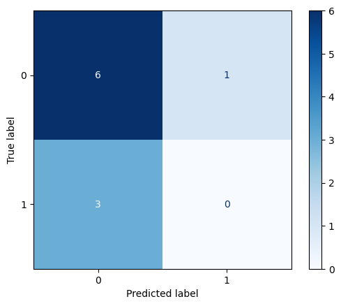

# Movie Review Sentiment Analysis

[Notebook](movie-review.ipynb)  
[Flask App](app.py)

## Description
This Flask app deploys a Naive Bayes classifier model built from scratch, to Docker to be used for instant-classification of inputted reviews.

A model working in a Jupyter notebook is only 10% of the battle when it comes to full-stack Data Science & MLOps. I deploy a model e2e.

## Goals
* ML Model deployment e2e 
* Docker Deployment
* Flask app deployment
* Software Engineer a usable, interactive app beyond just deployment and classification
  * Interactive animations based on classified sentiment
  * Sleek, attractive design
* Get hands-on experience applying a Naive Bayes classifier by making it from scratch

# Demo

### positive

### negative (sad)

### negative (angry)

# Results
With a balanced dataset of exactly 50% positive and 50% negative class (feeds into the Naive prior probability) and 
a custom NB model, we get weak results. Of course major improvements can be made by leveraging more powerful models 
that don't have the inherent naivety of prior probabilities.

# References:
Face Emoji with Emotion 
https://codepen.io/benjyring/pen/YmPRZx

Contact Form UI
https://codepen.io/krisantuswanandi/pen/KxrgeZ